# BOOK MY INTERVIEW - What We Have Built So Far

This document explains the current BOOK MY INTERVIEW build in detail and includes Mermaid flowcharts for the product, backend, frontend, secure data flow, account lifecycle, monitoring, export, CI, and deployment direction.

## 1. Executive Summary

BOOK MY INTERVIEW has been built into a working full-stack AI hiring operating system MVP. It now includes a FastAPI backend, React/Vite frontend, role-based authentication, secure tenant-scoped workspace APIs, job and talent creation flows, assessment path generation, account lifecycle contracts, database lifecycle models, protected operations monitoring, alert rules, filtered exports, production CORS configuration, CI workflow, and detailed documentation.

The project is no longer only a static prototype. It now has real backend contracts, frontend pages wired to APIs, role gates, tests, and production-readiness scaffolding.

## 2. What We Have Built

### 2.1 Product Foundation

Built components:

- Full-stack project structure.
- FastAPI backend.
- React/Vite frontend.
- Premium UI routing through `RouterNext.jsx`.
- Product pages for workspace, client portal, intake, engine, talent, insights, templates, reports, status, controls, cost, and monitor.
- Local development setup support.
- Production environment example.
- GitHub Actions hardening workflow.

### 2.2 Authentication and Access

Built components:

- User registration.
- User login.
- JWT access token creation.
- Refresh token lifecycle.
- Logout flow.
- Current-user endpoint.
- Role permission map.
- Route-level frontend protection.
- Backend capability checks for secure APIs.

Roles supported:

- `superadmin`
- `platform_admin`
- `client_admin`
- `hiring_manager`
- `candidate`
- `auditor`

### 2.3 Secure Workspace

Built components:

- Tenant-scoped secure workspace APIs.
- Secure job creation.
- Secure talent creation.
- Secure job list.
- Secure talent list.
- Secure assessment list.
- Secure overview endpoint.
- Frontend secure workspace suite.
- Client portal reads secure scoped data.
- Intake page creates secure jobs.
- Talent page creates secure talent.
- Engine page reads generated assessment paths.

### 2.4 Account Lifecycle

Built components:

- Account operations frontend page.
- Account lifecycle client.
- Recovery start and complete route contracts.
- Verification start and complete route contracts.
- Account challenge helper.
- Database lifecycle models for future full migration.

### 2.5 Database Lifecycle

Built components:

- `AccountChallenge` model.
- `SessionGrant` model.
- `SessionBlock` model.
- DB lifecycle service.
- DB session exchange route.
- DB session close route.
- Alembic-style lifecycle migration script.

### 2.6 Operational Monitor

Built components:

- Protected operations metrics API.
- Audit capability protection.
- Operations monitor page.
- KPI cards.
- Tenant/action/risk/day filters.
- Saved presets.
- Alert rules.
- Alert cards.
- Event drilldown rows.
- Event detail endpoint.
- Selected event payload preview.
- Filtered CSV export endpoint.
- Browser CSV export button.

### 2.7 Production Hardening

Built components:

- CORS configurable through environment.
- Production env example.
- Development-only legacy route protection.
- CI workflow for backend tests and frontend build.
- Test coverage for core contracts.
- Detailed documentation files under `docs/`.

## 3. Current System Architecture

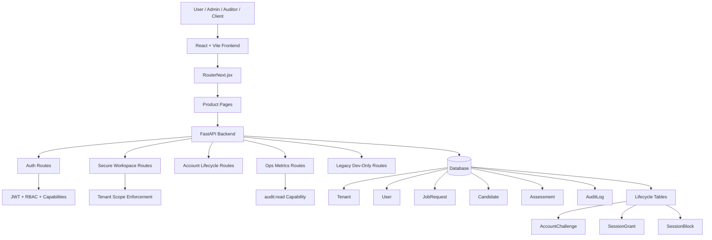

## 4. Frontend Flow

```mermaid
flowchart LR
    Browser[Browser] --> Index[index.html]
    Index --> Boot[bootNext.jsx]
    Boot --> Router[RouterNext.jsx]

    Router --> Public[Public Routes]
    Router --> Protected[Protected Routes]

    Public --> Home[/]
    Public --> Login[/login]
    Public --> Account[/account]

    Protected --> Workspace[/workspace]
    Protected --> Client[/client]
    Protected --> Intake[/intake]
    Protected --> Talent[/talent]
    Protected --> Engine[/engine]
    Protected --> Monitor[/monitor]

    Router --> RoleGate{Role Allowed?}
    RoleGate -->|Yes| Render[Render Page]
    RoleGate -->|No| Denied[Access Denied]
```

## 5. Authentication Flow

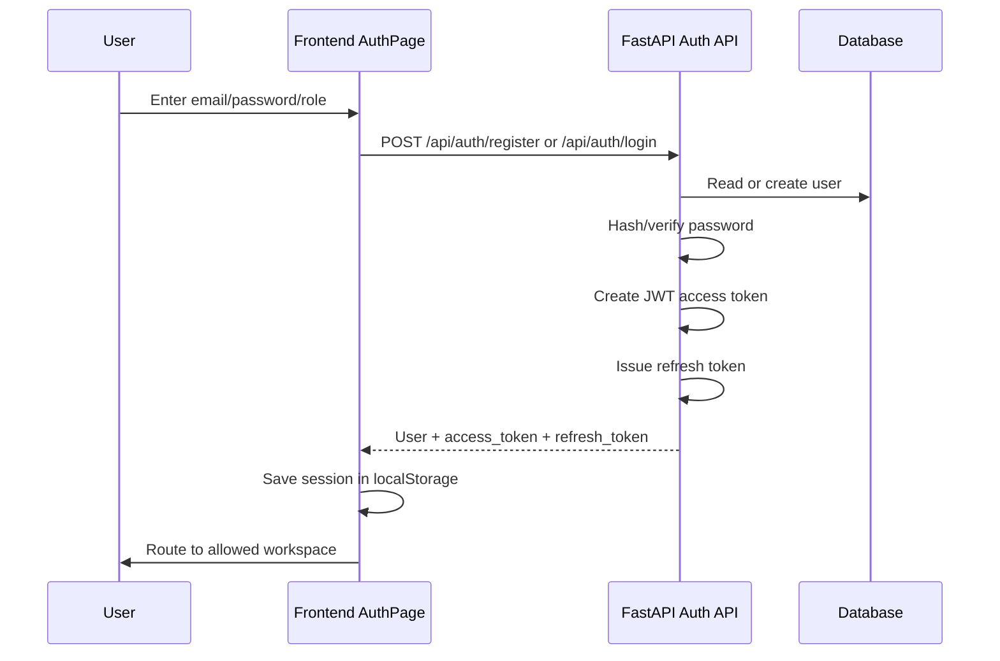

## 6. Role Gate Flow

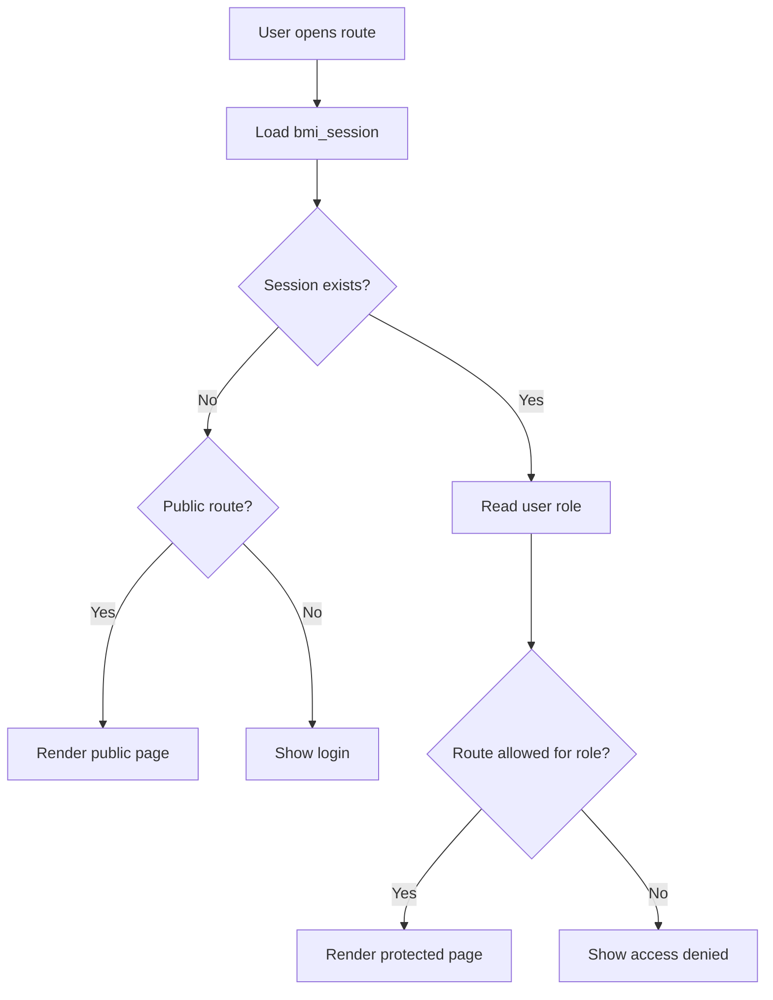

## 7. Secure Workspace Flow

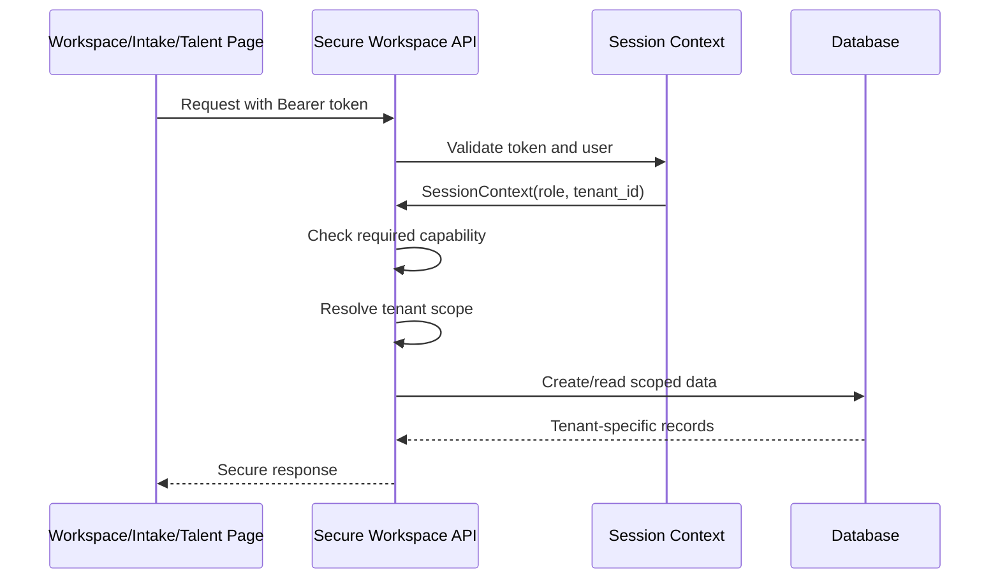

## 8. Job Creation and Assessment Path Flow

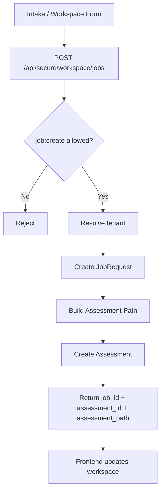

## 9. Talent Creation Flow

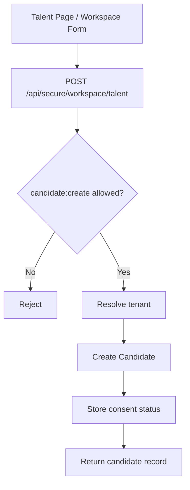

## 10. Account Lifecycle Flow

```mermaid
flowchart LR
    AccountOps[/account Page] --> AccountClient[accountClient.js]
    AccountClient --> StartRecovery[POST /api/account/recovery/start]
    AccountClient --> CompleteRecovery[POST /api/account/recovery/complete]
    AccountClient --> StartVerify[POST /api/account/verify/start]
    AccountClient --> CompleteVerify[POST /api/account/verify/complete]

    StartRecovery --> Challenge[Create challenge]
    CompleteRecovery --> UpdateCredential[Update account credential]
    StartVerify --> VerifyChallenge[Create verification challenge]
    CompleteVerify --> Verified[Return verified status]
```

## 11. Database Lifecycle Flow

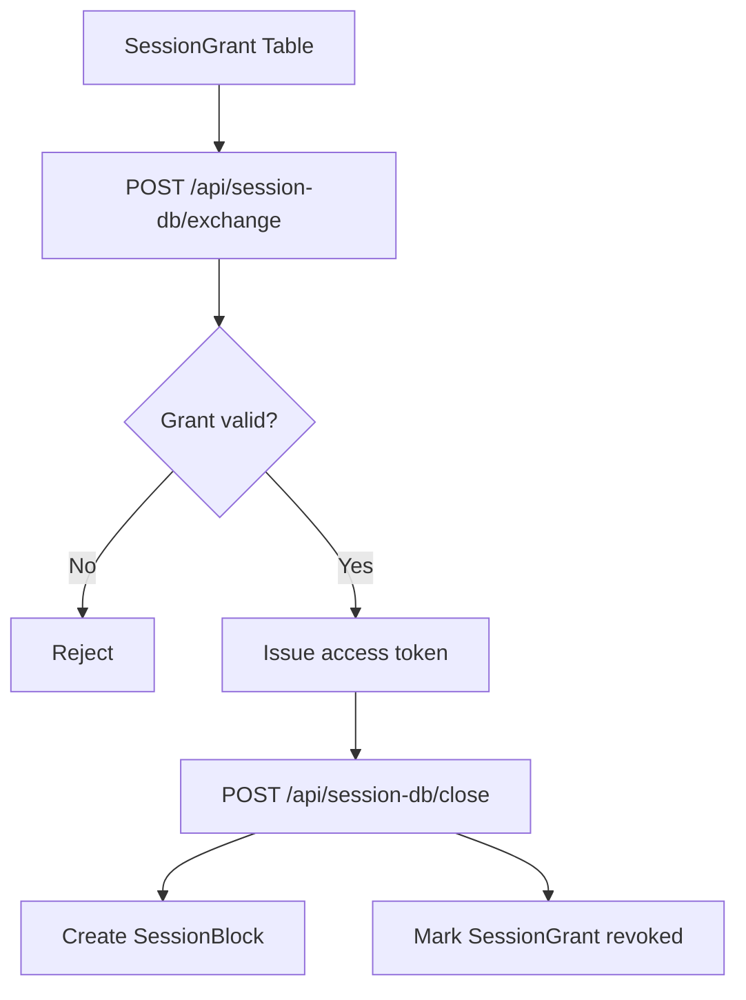

## 12. Operations Monitor Flow

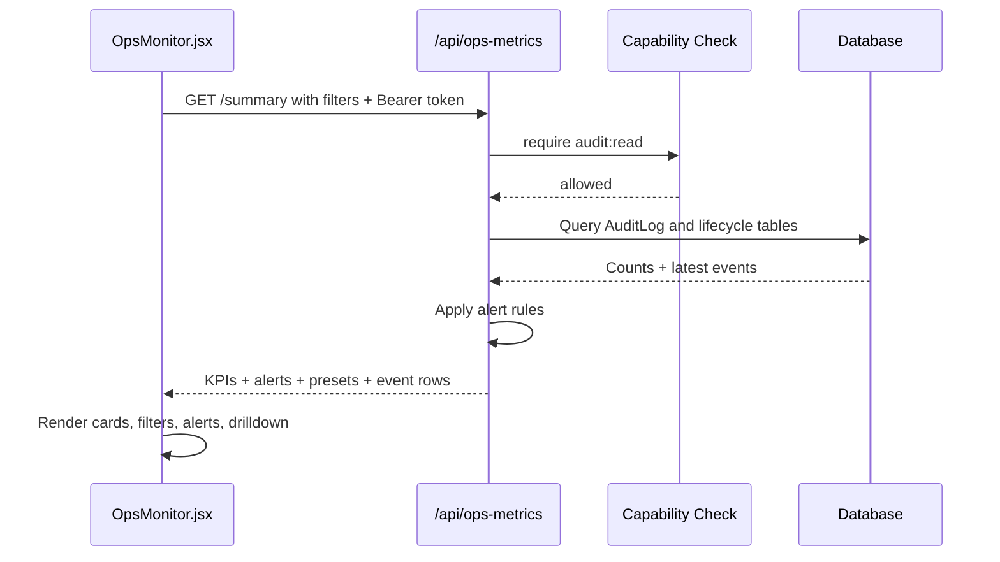

## 13. Monitor Export Flow

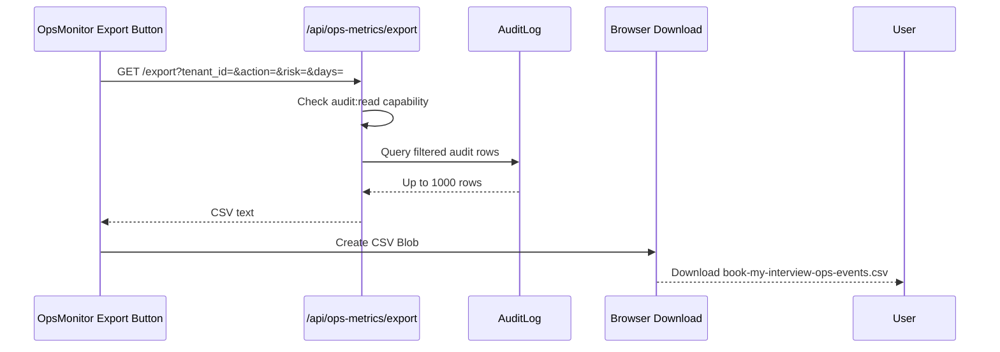

## 14. Monitor Event Detail Flow

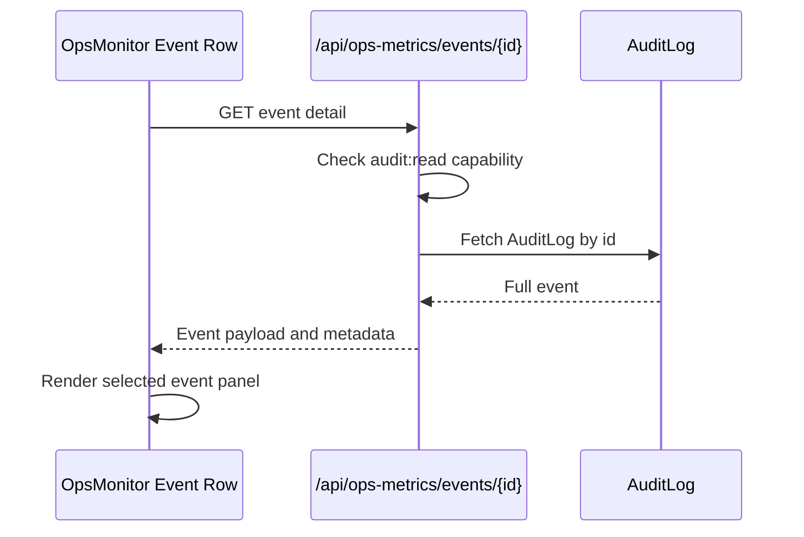

## 15. Production Route Policy Flow

```mermaid
flowchart TD
    Request[Incoming API Request] --> RouteGroup{Route Group}
    RouteGroup --> Legacy[/api/workspace or /api/data]
    RouteGroup --> Product[/api/auth, /api/secure/workspace, /api/ops-metrics]

    Legacy --> EnvCheck{APP_ENV dev-like?}
    EnvCheck -->|Yes| AllowLegacy[Allow legacy demo route]
    EnvCheck -->|No| BlockLegacy[Block in production]

    Product --> NormalAuth[Use normal auth/capability checks]
```

## 16. Deployment and CI Flow

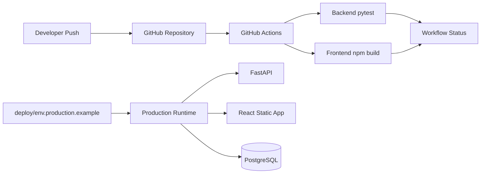

## 17. Built Backend Route Groups

| Route Group | Status | Purpose |
|---|---|---|
| `/api/auth` | Built | Register, login, refresh, logout, current user, permissions |
| `/api/secure/workspace` | Built | Tenant-scoped job, talent, assessment, overview APIs |
| `/api/account` | Built | Account recovery and verification contracts |
| `/api/session-db` | Built | DB-backed session grant exchange and close |
| `/api/ops-metrics` | Built | Protected monitor summary, presets, detail, export |
| `/api/workspace` | Dev-only | Legacy workspace/demo APIs |
| `/api/data` | Dev-only | Legacy data/demo APIs |

## 18. Built Frontend Pages

| Route | Built Page | Purpose |
|---|---|---|
| `/login` | AuthPage | Login and registration |
| `/account` | AccountOps | Account lifecycle operations |
| `/workspace` | WorkspaceSecureSuite | Secure job/talent creation and scoped data |
| `/secure` | SecureWorkspace | Secure workspace read view |
| `/client` | ClientPortalLive | Client command center |
| `/intake` | IntakeLive | Secure job intake |
| `/talent` | TalentPage | Secure candidate creation |
| `/engine` | EnginePage | Assessment path view |
| `/monitor` | OpsMonitor | Protected operations dashboard |
| `/report` | ReportStudio | Client report preview |
| `/status` | StatusBoard | Status board |
| `/controls` | ControlRoom | Regional controls |
| `/cost` | CostControlCenter | Cost governance |

## 19. Built Test Coverage

Backend tests cover:

- Auth contract.
- Secure workspace contract.
- Route mounting.
- Route policy.
- Account lifecycle contract.
- DB session lifecycle contract.
- CORS configuration.
- Delivery adapter contract.
- Operations metrics filters, presets, rules, and export.

Frontend tests cover:

- Major route render smoke checks.
- Route headings for active pages.

## 20. What Is Production-Ready vs MVP

### Strong foundation already built

- Secure route direction.
- Role-based frontend access.
- Capability-protected backend APIs.
- Tenant-scoped secure workspace.
- Operational monitoring.
- CSV export.
- CI workflow definition.
- Production environment example.
- Database lifecycle model definitions.

### Still MVP / next production work

- Some lifecycle challenge routes still use earlier helper patterns.
- Full identity provider callback is not mounted yet.
- Email/message delivery is mock-only.
- Refresh/session lifecycle should be fully consolidated around DB or Redis.
- Production secret storage must be externalized to a real secret manager.
- CI workflow status should be verified once GitHub Actions runs are visible.
- Alembic migration should be wired into actual deployment migration commands.

## 21. Next Recommended Build Plan

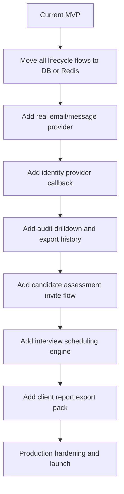

## 22. Developer Handoff Checklist

Before next major release:

- Run backend tests with `pytest -q`.
- Run frontend build with `npm run build`.
- Confirm GitHub Actions status.
- Validate production env values.
- Replace mock message provider.
- Decide Redis vs database for session lifecycle.
- Complete account lifecycle DB migration.
- Add identity provider callback route.
- Add real tenant-level admin settings.

## 23. Final Summary

We have built a strong enterprise-ready foundation for BOOK MY INTERVIEW:

- A full-stack hiring SaaS MVP.
- Secure role-based authentication.
- Tenant-scoped workspace APIs.
- Job and talent creation workflows.
- Assessment path generation.
- Account lifecycle contracts.
- Database lifecycle models.
- Protected operations monitor.
- Filters, presets, alerts, drilldown, and export.
- CI and production configuration scaffolding.
- Detailed documentation and system flow maps.

The project is now ready for the next stage: replacing remaining MVP-only lifecycle pieces with production-grade DB/Redis-backed services, adding real message delivery, integrating identity provider login, and expanding the hiring workflow into candidate invites and interview scheduling.
