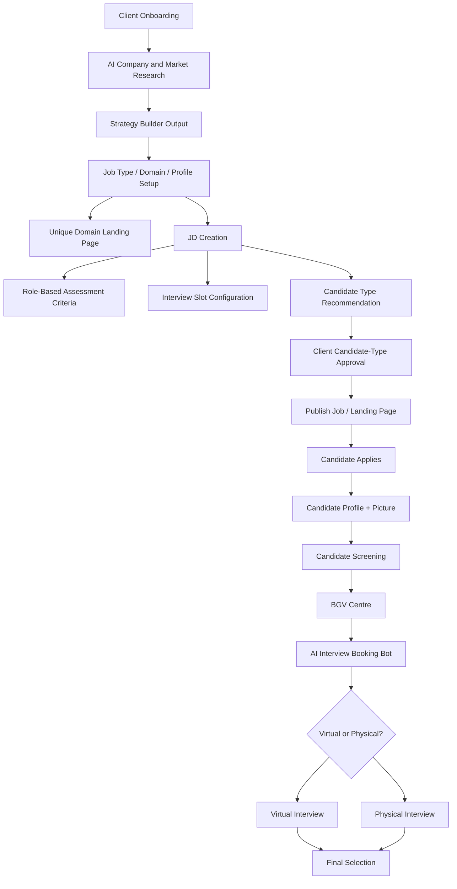
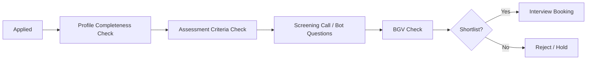
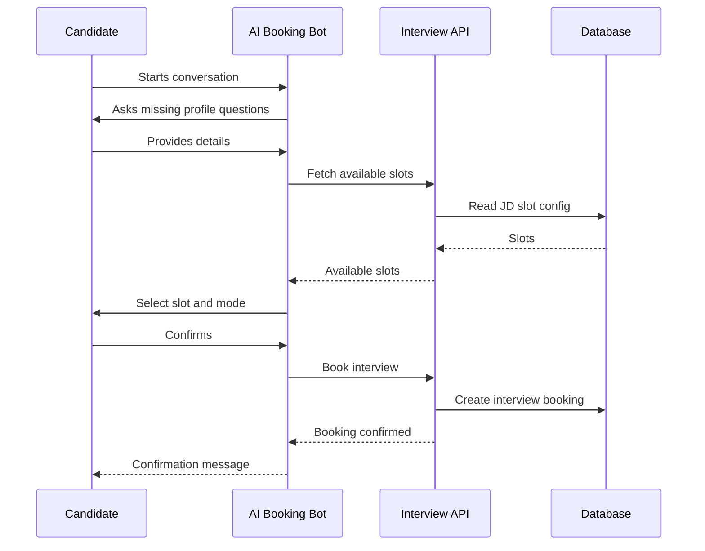
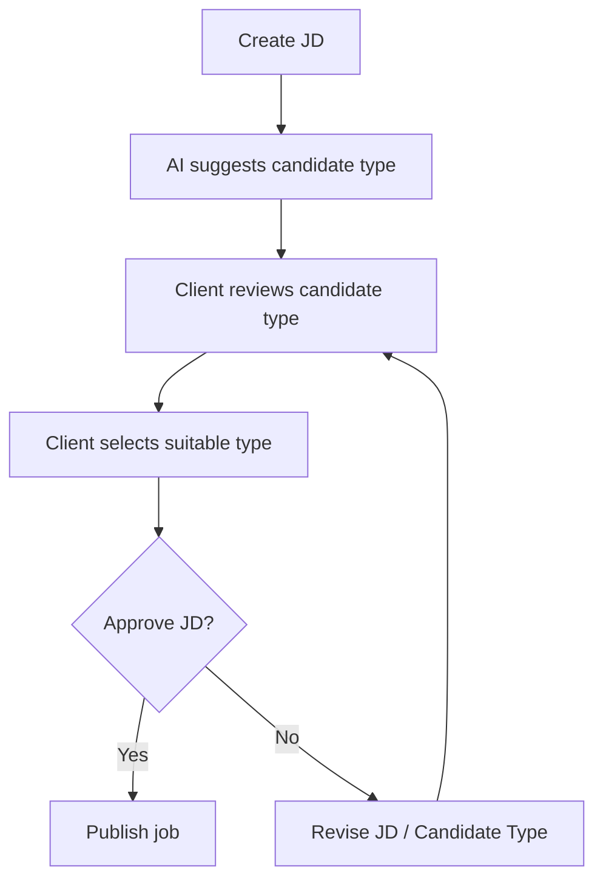
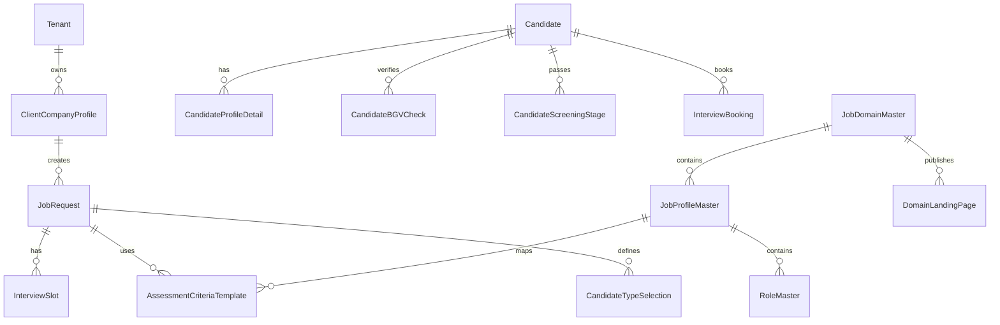
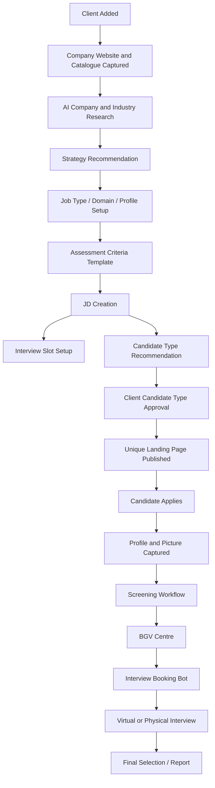

# BOOK MY INTERVIEW - CEO Discussion Product Roadmap

Date: 2026-06-22
Context: CEO discussion points converted into product requirements, workflow design, implementation modules, data structure, and build roadmap.

## 1. Executive Summary

The CEO discussion expands BOOK MY INTERVIEW from a hiring workflow MVP into a deeper AI-powered recruitment intelligence platform. The new direction requires the system to support market research, company intelligence, domain-specific landing pages, configurable assessment engines, candidate screening, BGV verification, interview booking, client onboarding, and client-approved candidate-type selection.

This roadmap converts the discussion points into a buildable product plan aligned with the current project architecture.

## 2. Strategic Product Direction

The project should now evolve into five major product pillars:

1. AI Market Research and Strategy Builder.
2. Client and Company Intelligence Engine.
3. Domain-Based Job and Assessment Configuration.
4. Candidate Screening, BGV, and Interview Booking Journey.
5. Client Approval and Candidate-Type Selection Workflow.

## 3. CEO Discussion Summary Table

| S.No. | Discussion Point | Product Requirement | Build Module | Priority | Status |
|---:|---|---|---|---|---|
| 1 | Strategy building | AI-based market research and strategy output | AI Strategy Builder | P1 | Open |
| 2 | Experience, skill and traits assessment | Domain/profile based assessment engine | Assessment Config Engine | P1 | Open |
| 3 | Job type/domain setup | Add job type, domain, profile, role | Master Setup | P1 | Open |
| 4 | Candidate profile details | Capture structured candidate profile | Candidate Profile | P1 | Open |
| 5 | Picture information | Candidate picture/profile image | Candidate Media | P2 | Open |
| 6 | BGV centre | Candidate verification/BGV centre | BGV Module | P1 | Open |
| 7 | Candidate screening | Screening before final interview | Screening Workflow | P1 | Open |
| 8 | Unique landing page | Landing page by job domain | Domain Landing Builder | P1 | Open |
| 9 | Interview booking | AI bot captures more info and books interview | Interview Bot | P1 | Open |
| 10 | Interview type | Virtual/physical interview support | Interview Mode Setup | P1 | Open |
| 11 | Slot selection | Slot/date/time in JD creation | JD Slot Config | P1 | Open |
| 12 | Client onboarding | Add website and AI company research | Client Onboarding AI | P1 | Open |
| 13 | Client catalogue | Name, website, catalogue, industry, market size | Client Master | P1 | Open |
| 14 | Deep research | AI research on company/industry | Research Intelligence | P1 | Open |
| 15 | JD approval | Candidate type visible before approval | JD Approval Flow | P2 | Open |
| 16 | Candidate type | Low/high salary, fresher, experienced, stability type | Candidate Classification | P1 | Open |
| 17 | Client selection | Client approves suitable candidate type | Client Preference Flow | P1 | Open |

## 4. Target Future Workflow



## 5. New Module Breakdown

### 5.1 AI Strategy Builder

Purpose:

- Perform market research for client/company/domain.
- Produce hiring strategy output.
- Suggest role demand, hiring market trends, compensation range, talent availability, and candidate sourcing strategy.

Inputs:

- Client name.
- Website.
- Industry type.
- Market size.
- Hiring domain.
- Job profile.
- Geography.
- Experience level.

Outputs:

- Market summary.
- Hiring strategy.
- Candidate availability insight.
- Salary range estimate.
- Suggested candidate type.
- Risk and challenge summary.
- Recommended screening criteria.

Backend requirement:

- New service: `strategy_research_service.py`.
- New API group: `/api/strategy`.
- Store research output against client and job domain.

Frontend requirement:

- New page: `StrategyBuilder.jsx`.
- Add route: `/strategy`.

### 5.2 Client Onboarding and Company Intelligence

Purpose:

- Capture client master data.
- Perform AI research from website and industry context.
- Build client profile and catalogue.

Required fields:

| Field | Type | Required |
|---|---|---|
| Client Name | Text | Yes |
| Website | URL | Yes |
| Catalogue / Services | Text / Upload / URL | Optional |
| Industry Type | Dropdown | Yes |
| Market Size | Dropdown/Text | Optional |
| Geography | Dropdown | Optional |
| Company Description | Long Text | Optional |
| AI Research Summary | Generated | Yes |
| Hiring Strategy Notes | Generated | Optional |

Backend requirement:

- New model: `ClientCompanyProfile`.
- Fields for website, industry, market size, catalogue summary, AI research output.

Frontend requirement:

- Extend `/client` or create `/client-onboarding`.

### 5.3 Job Type, Domain, Profile and Role Master

Purpose:

- Allow admins to create and manage job type/domain/profile/role masters.
- These masters drive landing pages, assessments, JD creation, and candidate screening.

Required master objects:

| Master | Example |
|---|---|
| Job Type | Full-time, Part-time, Contract, Internship |
| Domain | BPO, Sales, IT, Finance, Healthcare, Operations |
| Profile | Customer Support, Sales Executive, Software Developer |
| Role | Junior Agent, Senior Agent, Team Lead, Analyst |
| Experience Band | Fresher, 0-1 year, 1-3 years, 3-5 years |
| Skill Cluster | Communication, Sales, Technical, Analytical |
| Trait Cluster | Stability, Confidence, Integrity, Adaptability |

Backend requirement:

- New models: `JobTypeMaster`, `JobDomainMaster`, `JobProfileMaster`, `RoleMaster`.
- Link job profile to assessment criteria.

Frontend requirement:

- Extend `/master` page.

### 5.4 Configurable Assessment Engine

Purpose:

- Build assessments based on domain/profile/role.
- Include experience, skills, personality traits, stability, salary fit, and course/job suitability.

Assessment dimensions:

| Dimension | Example Criteria |
|---|---|
| Experience | Fresher, experienced, relevant experience |
| Skill | Communication, typing, domain knowledge, sales pitch |
| Traits | Confidence, learning ability, stability, discipline |
| Salary Fit | Low salary, high salary, budget fit |
| Stability | Job stability, course stability, tenure likelihood |
| Role Fit | JD match, process match, domain match |

Backend requirement:

- New model: `AssessmentCriteriaTemplate`.
- Link templates to domain/profile/role.
- Assessment generation should read these templates.

Frontend requirement:

- Add configuration section in `/engine` or `/master`.

### 5.5 Candidate Profile and Picture

Purpose:

- Capture a complete structured candidate profile.
- Store candidate picture/profile image.

Required fields:

| Section | Fields |
|---|---|
| Basic Info | Name, phone, email, city, state |
| Profile Info | Current role, experience, expected salary, notice period |
| Education | Highest qualification, course, institute |
| Work History | Last company, tenure, reason for leaving |
| Documents | Resume, picture, ID proof placeholder |
| Preferences | Job type, domain, shift, location |
| Classification | Fresher/experienced, salary band, stability type |

Backend requirement:

- Extend `Candidate` model or create `CandidateProfileDetail`.
- Add media reference field for profile image.

Frontend requirement:

- Extend `/talent` page.
- Add picture upload/preview component.

### 5.6 BGV Centre

Purpose:

- Create a candidate verification centre for background verification.

BGV checks:

| Check | Description |
|---|---|
| Identity Check | ID proof status |
| Employment Check | Prior employer validation |
| Education Check | Qualification validation |
| Address Check | Address verification |
| Reference Check | Reference validation |
| Risk Flag | Any red flag or mismatch |

Backend requirement:

- New model: `CandidateBGVCheck`.
- Status values: pending, in_progress, verified, failed, needs_review.

Frontend requirement:

- New page or tab: `/bgv` or Candidate detail BGV section.

### 5.7 Candidate Screening Workflow

Purpose:

- Add screening before final interview/selection.

Screening stages:



Backend requirement:

- New model: `CandidateScreeningStage`.
- Store stage, score, notes, recommendation.

Frontend requirement:

- Candidate journey timeline.
- Screening status actions.

### 5.8 Unique Landing Page by Job Domain

Purpose:

- Every domain/profile should have a dedicated landing page.

Landing page content:

- Client branding.
- Role/domain description.
- Job benefits.
- Required skills.
- Salary band.
- Location/shift.
- Apply button.
- AI chatbot entry.

Backend requirement:

- New model: `DomainLandingPage`.
- Slug support: `/apply/{client}/{domain}/{profile}`.

Frontend requirement:

- Dynamic public route for domain landing page.

### 5.9 Interview Booking Bot

Purpose:

- AI bot captures missing candidate information and books interview.

Bot responsibilities:

- Ask missing profile details.
- Confirm candidate type.
- Confirm interview mode.
- Show available slots.
- Book selected slot.
- Send confirmation.

Flow:



Backend requirement:

- New model: `InterviewSlot`.
- New model: `InterviewBooking`.
- New API group: `/api/interviews`.

Frontend requirement:

- Bot UI or guided wizard.
- Interview mode selector.

### 5.10 Interview Type and Slot Setup

Purpose:

- JD creation should collect interview mode and slot availability.

Fields:

| Field | Type |
|---|---|
| Interview Mode | Virtual / Physical / Both |
| Interview Location | Text |
| Meeting Link | URL |
| Slot Date | Date |
| Slot Start Time | Time |
| Slot End Time | Time |
| Slot Capacity | Number |
| Interview Panel | User list |

Backend requirement:

- Add interview slot model.
- Link slots to job request.

Frontend requirement:

- Extend `/intake` JD creation flow.

### 5.11 JD Approval and Candidate Type Selection

Purpose:

- Before JD approval, candidate type must be visible.
- Client should select/approve candidate type.

Candidate types:

- Low salary.
- High salary.
- Fresher.
- Experienced.
- Course stability type.
- Job stability type.
- Location-flexible.
- Immediate joiner.
- Notice-period candidate.

Approval flow:



Backend requirement:

- New model: `CandidateTypeTemplate`.
- Add selected candidate type to `JobRequest` or linked JD approval table.

Frontend requirement:

- Extend JD approval page.
- Show candidate type recommendation and client selection options.

## 6. Proposed Data Model Additions



Recommended new tables:

| Table | Purpose |
|---|---|
| client_company_profiles | Client onboarding and research output |
| job_type_masters | Job type master |
| job_domain_masters | Domain master |
| job_profile_masters | Profile master |
| role_masters | Role master |
| assessment_criteria_templates | Configurable role/domain criteria |
| candidate_profile_details | Extended candidate details |
| candidate_bgv_checks | BGV verification records |
| candidate_screening_stages | Screening workflow stages |
| domain_landing_pages | Public landing pages by domain/profile |
| interview_slots | JD-level interview slot setup |
| interview_bookings | Candidate interview booking records |
| candidate_type_templates | Candidate type master |
| candidate_type_selections | Client-approved candidate type for JD |
| research_outputs | AI company/industry strategy outputs |

## 7. Build Priority Roadmap

### Phase 1 - Master Setup and Client Onboarding

Build first:

1. Client company profile master.
2. Job type/domain/profile/role master.
3. Candidate type master.
4. Interview mode and slot setup in JD.

Reason:

These are base configuration tables. Other modules depend on them.

### Phase 2 - AI Research and Strategy Builder

Build second:

1. Client website capture.
2. AI company research output.
3. Industry/market research output.
4. Hiring strategy recommendation.
5. Candidate type suggestion.

Reason:

This fulfills CEO points around market research, strategy building, client onboarding, catalogue, and deep research.

### Phase 3 - Assessment Engine Upgrade

Build third:

1. Configurable assessment criteria by domain/profile/role.
2. Skills, experience, traits, salary fit, stability dimensions.
3. Assessment path generation from criteria.

Reason:

This makes the existing assessment path generator more intelligent and configurable.

### Phase 4 - Candidate Profile, Screening and BGV

Build fourth:

1. Structured candidate profile.
2. Picture/profile image support.
3. Candidate screening workflow.
4. BGV centre.
5. Candidate journey timeline.

Reason:

This improves candidate quality control before interview booking.

### Phase 5 - Landing Pages and Interview Booking Bot

Build fifth:

1. Unique landing page per job domain/profile.
2. Public apply route.
3. AI booking bot/wizard.
4. Virtual/physical interview mode.
5. Slot booking.

Reason:

This completes the public candidate acquisition and scheduling journey.

### Phase 6 - JD Approval and Client Candidate Type Selection

Build sixth:

1. Candidate type recommendation at JD approval.
2. Client-side candidate type selection.
3. Approval/revision flow.
4. Candidate type analytics.

Reason:

This gives clients control before publishing and helps improve selection accuracy.

## 8. End-to-End Future Product Flow



## 9. Mapping to Current System

| CEO Requirement | Current System Support | Gap | Proposed Module |
|---|---|---|---|
| Strategy building | Not yet built | Need AI research and strategy | Strategy Builder |
| Assessment by role/domain | Basic assessment path exists | Needs configurable criteria | Assessment Criteria Engine |
| Job type/domain setup | Master page exists | Need DB-backed masters | Master Setup Expansion |
| Candidate profile | Candidate creation exists | Need structured detail | Candidate Profile Detail |
| Picture | Not yet built | Need media support | Candidate Media |
| BGV centre | Not yet built | Need BGV workflow | BGV Centre |
| Candidate screening | Not yet built | Need screening stages | Screening Workflow |
| Unique landing page | Landing page exists | Need dynamic domain pages | Domain Landing Builder |
| Interview booking | Not yet built | Need bot and booking APIs | Interview Booking Bot |
| Virtual/physical interview | Not yet built | Need interview mode | Interview Setup |
| Slot in JD creation | Not yet built | Need slot config | JD Slot Setup |
| Client onboarding AI research | Basic client page exists | Need company profile research | Client Intelligence |
| Client catalogue | Not yet built | Need client master format | Client Master |
| Deep research | Not yet built | Need research outputs | Research Intelligence |
| JD approval candidate type | Not yet built | Need approval flow | JD Approval |
| Candidate type categories | Not yet built | Need candidate type master | Candidate Classification |
| Client selects candidate type | Not yet built | Need client preference UI | Client Candidate Preference |

## 10. Immediate Technical Build Commands for Developer/Codex

Use this as the next implementation instruction:

```text
Build the next BOOK MY INTERVIEW modules from the CEO discussion roadmap.

Priority 1:
1. Add backend models for client company profile, job type master, job domain master, job profile master, role master, candidate type master, interview slot, and research output.
2. Add FastAPI route groups for /api/client-intelligence, /api/job-masters, /api/interviews, and /api/strategy.
3. Extend frontend RouterNext with /strategy, /client-onboarding, /job-masters, and /interviews.
4. Extend MasterStudio for job type/domain/profile/role setup.
5. Extend IntakeLive to capture interview mode and slot configuration.
6. Add tests for each new backend route group.
7. Add frontend smoke tests for new pages.

Keep all existing routes intact. Do not break /api/auth, /api/secure/workspace, /api/ops-metrics, /workspace, /intake, /talent, /monitor.
```

## 11. Final CEO Discussion Conclusion

The CEO discussion has shifted BOOK MY INTERVIEW toward a complete AI hiring intelligence platform. The immediate priority is to build the master data and intelligence foundation first: client profile, job type, domain, profile, role, candidate type, assessment criteria, and interview slot setup. Once these foundations are ready, the AI strategy builder, candidate screening, BGV centre, unique landing pages, and interview booking bot can be built cleanly on top.
